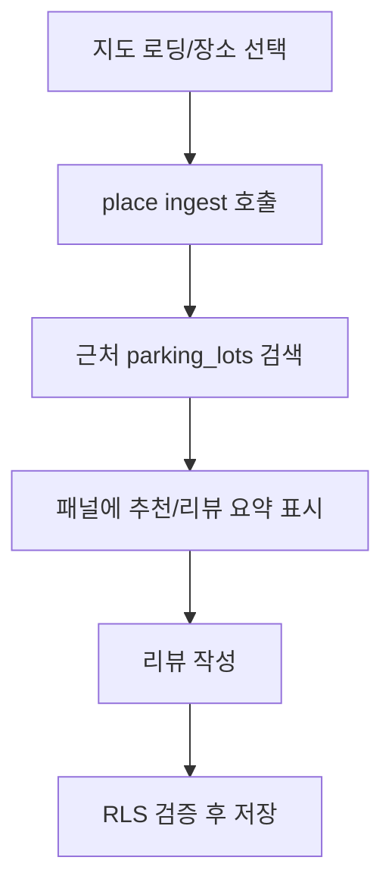
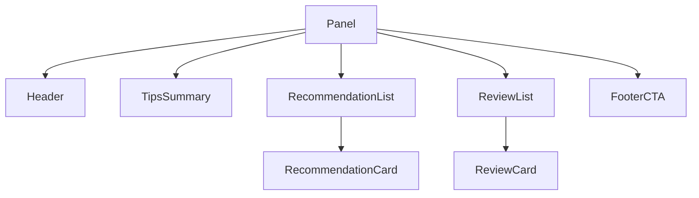

# 07. UX / Wireframes

## 상단 체크리스트
- [ ] 확장 패널 정보 구조(헤더/리스트/CTA) 확정
- [ ] 웹 서비스 메인/검색/상세 플로우 확정
- [ ] 화면별 수용 기준(DoD) 정의

> 초기 릴리즈에서는 이미지(사진) 관련 기능을 제공하지 않습니다.

## 확장(Phase 1)
- 헤더: 로고, 종합 평점
- 본문: 꿀팁 요약, 추천 주차장 카드, 리뷰 카드
- 푸터: 내 리뷰/꿀팁 등록 CTA

## 웹(Phase 2)
- 메인: 대형 지도 + 검색창
- 검색 결과: 좌 리스트 / 우 지도, 정렬/필터
- 상세: 상단 요약, 탭(정보/리뷰/주변)

## DoD(샘플)
- 확장: 장소 전환 시 1s 내 새 데이터 표시, 빈 상태 가이드
- 웹: 검색 입력→결과 노출 1.5s 내, 오류 토스트

---

## 세부 화면 설계 (확장)
- 로딩 상태: 스켈레톤 3개 카드, 600ms 최소 표시
- 빈 상태: "근처 주차 정보가 아직 없어요" + "리뷰 남기기" 버튼
- 오류 상태: 재시도 버튼 + 문의 링크
- 추천 주차장 카드:
  - 타이틀, 거리(도보 n분), 요금(10분/500원), 유형(공영/민영)
  - 클릭: 상세(웹)로 이동 또는 패널 내 확장
- 리뷰 카드:
  - 별점, 닉네임, 내용 2줄, 작성일, 도움돼요 수
  - 클릭: 전체 리뷰 보기(웹)

## 세부 화면 설계 (웹)
- 메인: 검색창 포커스 시 최근 검색/즐겨찾기 드롭다운
- 결과: 정렬(거리/가격/평점), 필터(유형/요금/시간), 페이지네이션
- 상세:
  - 요약: 평점, 가격 요약, 길찾기
  - 정보 탭: 요금표, 운영시간, 주차 방식
  - 리뷰 탭: 평균 평점, 정렬(최신/평점/도움순), 리뷰 작성 폼
  - 주변 탭: 근처 대체 주차장 추천

## 유저 플로우

## 컴포넌트 트리(확장 패널)

---

## 디자이너 명세 (Designer Specs)

### 1) 디자인 토큰(초안)
- 색상
  - Primary: #2C6AFF
  - Success: #16A34A, Warning: #F59E0B, Error: #DC2626
  - Text: #111827, Subtle: #6B7280, Divider: #E5E7EB, Background: #FFFFFF
- 타이포그래피
  - Heading: Pretendard Semibold, Body: Pretendard Regular
  - H1 20/28, H2 16/24, Body 14/20, Caption 12/16 (size/line-height)
- 라운드/간격
  - Radius: 8 (카드), 12 (패널), 999 (pill)
  - Spacing scale: 4, 8, 12, 16, 20, 24
- 그림자
  - Card: 0 1px 2px rgba(0,0,0,0.08), 0 4px 10px rgba(0,0,0,0.04)

### 2) 레이아웃/그리드
- 확장 패널: 360px 폭 고정, 내부 16px 패딩, 섹션 간 12px 간격
- 카드 리스트: 1열, 카드 간 8px 간격, 카드 내부 좌우 12px
- 버튼 높이: 36px(1차), 28px(보조)

### 3) 상태 정의
- 로딩: 스켈레톤 바 3개(카드 높이 대비 80%), 애니메이션 1.2s ease-in-out
- 빈 상태: 일러스트 없음(텍스트 중심), CTA 버튼 1개
- 오류: 에러 아이콘, 재시도 버튼, 보조 텍스트 2줄 이내
- 비활성: 텍스트/아이콘 불투명도 40%

### 4) 상호작용(패널)
- 카드 hover: 배경 #F9FAFB, 그림자 강화(소폭)
- 클릭 영역: 카드 전체 클릭 가능, 우측에 세부 링크가 있는 경우 우클릭 메뉴 제공하지 않음
- 목록 스크롤: iOS/Android 기본 스크롤, 스크롤바 커스텀 없음
- Transition: 섹션 토글 150ms, opacity 0.2s

### 5) 컴포넌트 스펙
- 추천 주차장 카드
  - 구조: 타이틀(한 줄 생략), 메타(거리/요금/유형), 액션(상세)
  - 아이콘: 유형별 심볼(공영/민영/제휴)
- 리뷰 카드
  - 별점(5점, 12px 아이콘), 닉네임(Body), 본문 2줄 생략, 날짜(해당일 상대시간)
  - 도움돼요 버튼: pill, count 표기, 토글 시 색상전환
- 필터/정렬(웹)
  - 필터 패널 오른쪽 슬라이드, 다중 선택, 적용/초기화 버튼

### 6) 접근성(A11y)
- 대비: 텍스트/배경 WCAG AA(레벨 텍스트 4.5:1) 충족
- 포커스: 키보드 Tab 이동 가능, 포커스 아웃라인 2px Primary
- 라벨: 버튼/아이콘 대체 텍스트 제공, 도움돼요는 aria-pressed 사용
- 모션: reduce motion 환경에서는 스켈레톤 애니메이션 off

### 7) 폼/검증
- 별점: 1~5 선택, 기본 0(미선택), 에러시 빨간 보더 + 헬퍼 텍스트
- 코멘트: 500자 제한, 0/500 카운터, 50자 미만 시 경고(권장)
- 제출: 로딩 스피너, 성공 토스트 "리뷰가 등록됐어요"

### 8) 카피 가이드(톤&매너)
- 톤: 친절/실용 중심, 과장 금지
- 버튼: 동사형(예: "리뷰 남기기", "다시 시도")
- 빈 상태: "아직 데이터가 없어요", 대안 행동 제시

### 9) 에러/토스트 카피 예시
- 네트워크 오류: "네트워크가 불안정해요. 다시 시도해 주세요."
- 권한 오류: "로그인이 필요해요."
- 성공: "리뷰가 등록됐어요"

> 디자인 토큰/컴포넌트 규칙은 `docs/13-apple-style-design-guide.md`를 참조하세요.
