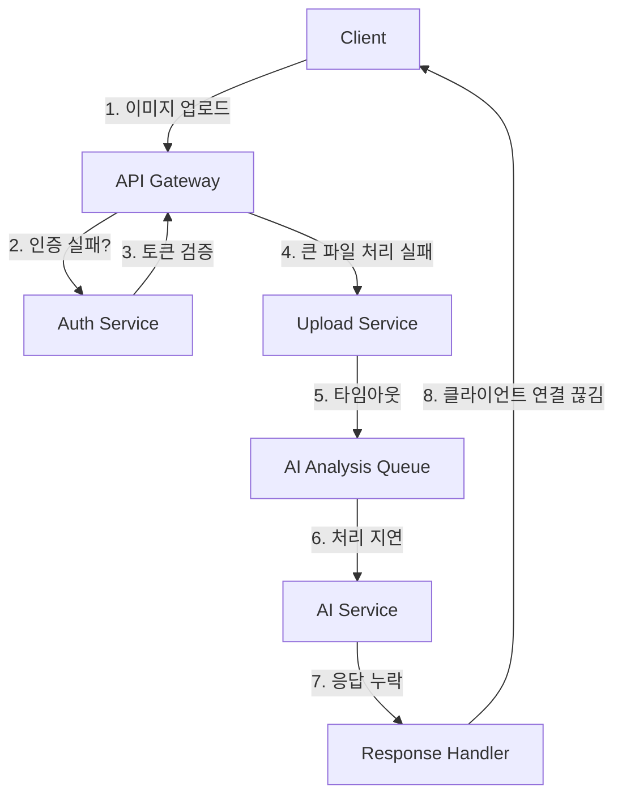
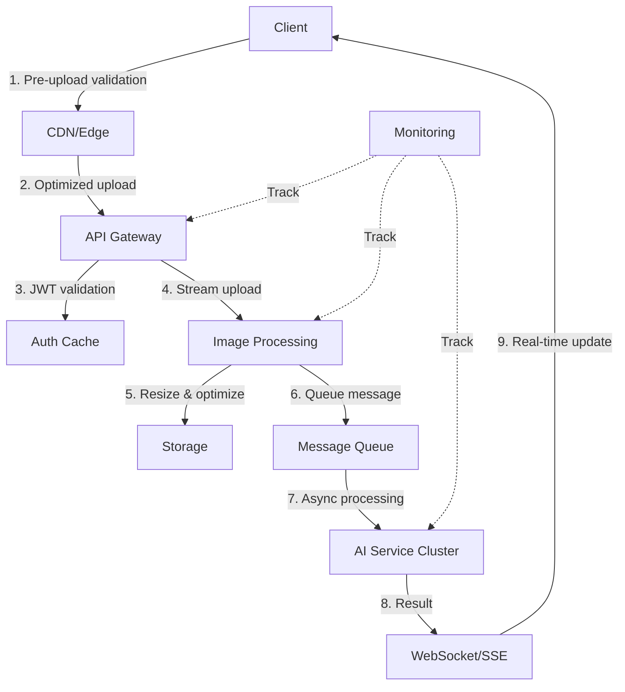

# AI 할일 기능 이미지 분석 API 통합 이슈 해결 설계서

## 목차
1. [체크리스트 및 화면 변화](#1-체크리스트-및-화면-변화)
2. [문제 분석](#2-문제-분석)
3. [시스템 아키텍처 검토](#3-시스템-아키텍처-검토)
4. [UX/UI 개선사항](#4-uxui-개선사항)
5. [기술적 해결방안](#5-기술적-해결방안)
6. [데이터베이스 설계](#6-데이터베이스-설계)
7. [API 설계 개선](#7-api-설계-개선)
8. [구현 로드맵](#8-구현-로드맵)

---

## 1. 체크리스트 및 화면 변화

### 점검 체크리스트
- [ ] API 통합 전후 이미지 업로드 프로세스 비교
- [ ] 이미지 처리 엔드포인트 변경사항 확인
- [ ] 인증/인가 메커니즘 변경 확인
- [ ] 이미지 파일 크기 및 포맷 제한 변경 확인
- [ ] CORS 정책 및 보안 설정 변경 확인
- [ ] 에러 로깅 시스템 점검
- [ ] API 요청/응답 페이로드 구조 변경 확인
- [ ] 타임아웃 설정 및 리트라이 로직 확인
- [ ] 클라이언트-서버 간 데이터 직렬화 방식 확인
- [ ] 이미지 분석 AI 모델 버전 및 설정 변경 확인

### 화면 전후 비교

#### Before (API 통합 전)
```
┌─────────────────────────────────┐
│  AI 할일 생성                    │
├─────────────────────────────────┤
│  📷 이미지 업로드               │
│  ┌───────────────┐             │
│  │               │             │
│  │  [이미지 미리보기]  │        │
│  │               │             │
│  └───────────────┘             │
│                                 │
│  ✅ 분석 완료!                  │
│  생성된 할일:                   │
│  • 회의 자료 준비               │
│  • 이메일 답장                  │
│  • 프로젝트 마감일 확인         │
│                                 │
│  [할일 목록에 추가]             │
└─────────────────────────────────┘
```

#### After (API 통합 후 - 현재 문제 상황)
```
┌─────────────────────────────────┐
│  AI 할일 생성                    │
├─────────────────────────────────┤
│  📷 이미지 업로드               │
│  ┌───────────────┐             │
│  │               │             │
│  │  [이미지 미리보기]  │        │
│  │               │             │
│  └───────────────┘             │
│                                 │
│  ❌ 이미지 분석 실패            │
│  오류: 이미지를 처리할 수       │
│  없습니다. 다시 시도해주세요.   │
│                                 │
│  [다시 시도]                    │
└─────────────────────────────────┘
```

#### 개선 후 목표 화면
```
┌─────────────────────────────────┐
│  AI 할일 생성                    │
├─────────────────────────────────┤
│  📷 이미지 업로드               │
│  ┌───────────────┐             │
│  │               │             │
│  │  [이미지 미리보기]  │        │
│  │               │             │
│  └───────────────┘             │
│                                 │
│  🔄 분석 중... (15%)            │
│  [===>               ]          │
│                                 │
│  💡 팁: 텍스트가 선명한 이미지를│
│  업로드하면 더 정확한 결과를    │
│  얻을 수 있습니다.              │
│                                 │
│  [취소]                         │
└─────────────────────────────────┘
```

---

## 2. 문제 분석

### 2.1 근본 원인 분석

#### API 통합 전 아키텍처
```
Client (Web/App) → Local Image Processing → Direct AI Model → Todo Generation
```

#### API 통합 후 아키텍처
```
Client → API Gateway → Auth → Image Upload → Queue → AI Service → Response
```

### 2.2 주요 문제점

1. **이미지 업로드 프로세스 변경**
   - Base64 인코딩에서 multipart/form-data로 변경
   - 최대 파일 크기 제한 미설정
   - 이미지 포맷 검증 누락

2. **API 통신 문제**
   - CORS 설정 불일치
   - 인증 토큰 전달 방식 변경
   - Request timeout 설정 부적절

3. **에러 핸들링 미흡**
   - 에러 응답 형식 불일치
   - 클라이언트 측 에러 처리 로직 미구현
   - 재시도 메커니즘 부재

4. **비동기 처리 문제**
   - 동기적 처리에서 비동기 큐 방식으로 변경
   - 폴링 메커니즘 미구현
   - 웹소켓 연결 불안정

---

## 3. 시스템 아키텍처 검토

### 3.1 현재 아키텍처의 문제점



### 3.2 개선된 아키텍처 제안



---

## 4. UX/UI 개선사항

### 4.1 사용자 경험 개선

1. **진행 상태 표시**
   ```typescript
   interface UploadProgress {
     stage: 'uploading' | 'processing' | 'analyzing' | 'generating';
     percentage: number;
     estimatedTime?: number;
     message: string;
   }
   ```

2. **에러 메시지 개선**
   ```typescript
   interface UserFriendlyError {
     title: string;
     description: string;
     suggestion: string;
     actionButton?: {
       label: string;
       action: () => void;
     };
   }
   ```

3. **오프라인 지원**
   - 이미지 로컬 캐싱
   - 오프라인 큐잉
   - 자동 재시도

### 4.2 UI 컴포넌트 개선

```tsx
// ImageUploadComponent.tsx
const ImageUploadComponent = () => {
  return (
    <div className="upload-container">
      <DropZone 
        accept="image/*"
        maxSize={10 * 1024 * 1024} // 10MB
        onDrop={handleDrop}
      />
      
      {uploading && (
        <ProgressIndicator
          stage={uploadProgress.stage}
          percentage={uploadProgress.percentage}
          message={uploadProgress.message}
        />
      )}
      
      {error && (
        <ErrorDisplay
          error={error}
          onRetry={handleRetry}
          onCancel={handleCancel}
        />
      )}
      
      <UploadTips />
    </div>
  );
};
```

---

## 5. 기술적 해결방안

### 5.1 이미지 업로드 개선

```typescript
// imageUploadService.ts
class ImageUploadService {
  private readonly MAX_FILE_SIZE = 10 * 1024 * 1024; // 10MB
  private readonly ALLOWED_TYPES = ['image/jpeg', 'image/png', 'image/webp'];
  private readonly CHUNK_SIZE = 1024 * 1024; // 1MB chunks
  
  async uploadImage(file: File): Promise<UploadResult> {
    // 1. 클라이언트 측 검증
    this.validateFile(file);
    
    // 2. 이미지 최적화
    const optimizedFile = await this.optimizeImage(file);
    
    // 3. 청크 업로드
    if (optimizedFile.size > this.CHUNK_SIZE) {
      return this.uploadInChunks(optimizedFile);
    }
    
    // 4. 일반 업로드
    return this.uploadDirect(optimizedFile);
  }
  
  private async optimizeImage(file: File): Promise<File> {
    const canvas = document.createElement('canvas');
    const ctx = canvas.getContext('2d');
    const img = await this.loadImage(file);
    
    // 최대 크기 제한
    const maxDimension = 2048;
    let { width, height } = img;
    
    if (width > maxDimension || height > maxDimension) {
      const ratio = Math.min(maxDimension / width, maxDimension / height);
      width *= ratio;
      height *= ratio;
    }
    
    canvas.width = width;
    canvas.height = height;
    ctx.drawImage(img, 0, 0, width, height);
    
    return this.canvasToFile(canvas, file.name);
  }
}
```

### 5.2 API 통신 개선

```typescript
// apiClient.ts
class EnhancedAPIClient {
  private readonly baseURL: string;
  private readonly timeout: number = 30000;
  private retryCount: number = 3;
  
  async uploadImageForAnalysis(
    file: File, 
    onProgress?: (progress: number) => void
  ): Promise<AnalysisResult> {
    const formData = new FormData();
    formData.append('image', file);
    formData.append('metadata', JSON.stringify({
      timestamp: Date.now(),
      clientVersion: process.env.CLIENT_VERSION,
      platform: this.detectPlatform()
    }));
    
    try {
      const response = await this.request({
        method: 'POST',
        url: '/api/v2/ai/analyze-image',
        data: formData,
        headers: {
          'X-Client-ID': this.clientId,
          'X-Request-ID': this.generateRequestId()
        },
        onUploadProgress: (progressEvent) => {
          const progress = (progressEvent.loaded / progressEvent.total) * 100;
          onProgress?.(progress);
        },
        timeout: this.timeout
      });
      
      return response.data;
    } catch (error) {
      return this.handleError(error);
    }
  }
  
  private async handleError(error: any): Promise<never> {
    if (error.response?.status === 413) {
      throw new FileTooLargeError('이미지 파일이 너무 큽니다. 10MB 이하로 줄여주세요.');
    }
    
    if (error.code === 'ECONNABORTED') {
      throw new TimeoutError('서버 응답 시간이 초과되었습니다. 잠시 후 다시 시도해주세요.');
    }
    
    if (error.response?.status >= 500) {
      // 서버 오류 시 재시도
      if (this.retryCount > 0) {
        this.retryCount--;
        await this.delay(1000 * (4 - this.retryCount));
        return this.uploadImageForAnalysis(/* ... */);
      }
    }
    
    throw new APIError(error.message);
  }
}
```

### 5.3 비동기 처리 개선

```typescript
// websocketService.ts
class WebSocketService {
  private ws: WebSocket | null = null;
  private reconnectAttempts = 0;
  private maxReconnectAttempts = 5;
  
  connect(analysisId: string): Promise<void> {
    return new Promise((resolve, reject) => {
      const wsUrl = `${process.env.WS_URL}/analysis/${analysisId}`;
      this.ws = new WebSocket(wsUrl);
      
      this.ws.onopen = () => {
        console.log('WebSocket connected');
        this.reconnectAttempts = 0;
        resolve();
      };
      
      this.ws.onmessage = (event) => {
        const data = JSON.parse(event.data);
        this.handleMessage(data);
      };
      
      this.ws.onerror = (error) => {
        console.error('WebSocket error:', error);
        this.handleReconnect(analysisId);
      };
      
      this.ws.onclose = () => {
        console.log('WebSocket closed');
        this.handleReconnect(analysisId);
      };
    });
  }
  
  private handleMessage(data: WSMessage) {
    switch (data.type) {
      case 'progress':
        this.emit('progress', data.payload);
        break;
      case 'result':
        this.emit('result', data.payload);
        break;
      case 'error':
        this.emit('error', data.payload);
        break;
    }
  }
  
  private async handleReconnect(analysisId: string) {
    if (this.reconnectAttempts < this.maxReconnectAttempts) {
      this.reconnectAttempts++;
      const delay = Math.min(1000 * Math.pow(2, this.reconnectAttempts), 30000);
      
      console.log(`Reconnecting in ${delay}ms...`);
      await this.delay(delay);
      
      this.connect(analysisId);
    } else {
      this.emit('error', new Error('WebSocket 연결을 재시도할 수 없습니다.'));
    }
  }
}
```

---

## 6. 데이터베이스 설계

### 6.1 테이블 스키마

```sql
-- 이미지 업로드 정보
CREATE TABLE image_uploads (
    id UUID PRIMARY KEY DEFAULT gen_random_uuid(),
    user_id UUID NOT NULL REFERENCES users(id),
    file_name VARCHAR(255) NOT NULL,
    file_size INTEGER NOT NULL,
    file_type VARCHAR(50) NOT NULL,
    storage_path TEXT NOT NULL,
    upload_status VARCHAR(20) NOT NULL DEFAULT 'pending',
    created_at TIMESTAMP WITH TIME ZONE DEFAULT CURRENT_TIMESTAMP,
    updated_at TIMESTAMP WITH TIME ZONE DEFAULT CURRENT_TIMESTAMP
);

-- AI 분석 작업
CREATE TABLE ai_analysis_jobs (
    id UUID PRIMARY KEY DEFAULT gen_random_uuid(),
    image_upload_id UUID NOT NULL REFERENCES image_uploads(id),
    status VARCHAR(20) NOT NULL DEFAULT 'queued',
    started_at TIMESTAMP WITH TIME ZONE,
    completed_at TIMESTAMP WITH TIME ZONE,
    error_message TEXT,
    retry_count INTEGER DEFAULT 0,
    result JSONB,
    created_at TIMESTAMP WITH TIME ZONE DEFAULT CURRENT_TIMESTAMP,
    updated_at TIMESTAMP WITH TIME ZONE DEFAULT CURRENT_TIMESTAMP
);

-- 생성된 할일 항목
CREATE TABLE ai_generated_todos (
    id UUID PRIMARY KEY DEFAULT gen_random_uuid(),
    analysis_job_id UUID NOT NULL REFERENCES ai_analysis_jobs(id),
    user_id UUID NOT NULL REFERENCES users(id),
    title VARCHAR(255) NOT NULL,
    description TEXT,
    priority INTEGER DEFAULT 0,
    due_date DATE,
    tags TEXT[],
    is_accepted BOOLEAN DEFAULT false,
    created_at TIMESTAMP WITH TIME ZONE DEFAULT CURRENT_TIMESTAMP
);

-- 인덱스
CREATE INDEX idx_image_uploads_user_id ON image_uploads(user_id);
CREATE INDEX idx_image_uploads_status ON image_uploads(upload_status);
CREATE INDEX idx_analysis_jobs_status ON ai_analysis_jobs(status);
CREATE INDEX idx_analysis_jobs_created ON ai_analysis_jobs(created_at);
CREATE INDEX idx_generated_todos_user_id ON ai_generated_todos(user_id);
```

### 6.2 성능 최적화

```sql
-- 분석 작업 상태 업데이트 함수
CREATE OR REPLACE FUNCTION update_analysis_job_status()
RETURNS TRIGGER AS $$
BEGIN
    NEW.updated_at = CURRENT_TIMESTAMP;
    
    -- 상태 변경 시 이벤트 발행
    PERFORM pg_notify(
        'analysis_status_changed',
        json_build_object(
            'job_id', NEW.id,
            'status', NEW.status,
            'user_id', (
                SELECT u.user_id 
                FROM image_uploads u 
                WHERE u.id = NEW.image_upload_id
            )
        )::text
    );
    
    RETURN NEW;
END;
$$ LANGUAGE plpgsql;

CREATE TRIGGER trigger_analysis_job_status_update
    BEFORE UPDATE ON ai_analysis_jobs
    FOR EACH ROW
    WHEN (OLD.status IS DISTINCT FROM NEW.status)
    EXECUTE FUNCTION update_analysis_job_status();
```

---

## 7. API 설계 개선

### 7.1 RESTful API 엔드포인트

```yaml
openapi: 3.0.0
info:
  title: AI Todo Image Analysis API
  version: 2.0.0

paths:
  /api/v2/ai/upload-image:
    post:
      summary: 이미지 업로드 및 분석 요청
      requestBody:
        content:
          multipart/form-data:
            schema:
              type: object
              properties:
                image:
                  type: string
                  format: binary
                  maxLength: 10485760  # 10MB
                options:
                  type: object
                  properties:
                    language:
                      type: string
                      enum: [ko, en, ja, zh]
                    priority:
                      type: string
                      enum: [low, medium, high]
      responses:
        '202':
          description: 분석 요청 접수
          content:
            application/json:
              schema:
                type: object
                properties:
                  jobId:
                    type: string
                    format: uuid
                  status:
                    type: string
                    enum: [queued, processing]
                  estimatedTime:
                    type: integer
                    description: 예상 처리 시간 (초)
                  websocketUrl:
                    type: string
                    format: uri
        '400':
          description: 잘못된 요청
        '413':
          description: 파일 크기 초과
        '429':
          description: 요청 제한 초과

  /api/v2/ai/analysis/{jobId}:
    get:
      summary: 분석 상태 조회
      parameters:
        - name: jobId
          in: path
          required: true
          schema:
            type: string
            format: uuid
      responses:
        '200':
          description: 분석 상태 및 결과
          content:
            application/json:
              schema:
                type: object
                properties:
                  jobId:
                    type: string
                  status:
                    type: string
                    enum: [queued, processing, completed, failed]
                  progress:
                    type: integer
                    minimum: 0
                    maximum: 100
                  result:
                    type: object
                    properties:
                      todos:
                        type: array
                        items:
                          type: object
                          properties:
                            title:
                              type: string
                            description:
                              type: string
                            priority:
                              type: string
                            dueDate:
                              type: string
                              format: date
                            confidence:
                              type: number
                              minimum: 0
                              maximum: 1
```

### 7.2 에러 응답 표준화

```typescript
interface APIError {
  error: {
    code: string;
    message: string;
    details?: any;
    timestamp: string;
    requestId: string;
    suggestions?: string[];
  };
}

// 에러 코드 정의
enum ErrorCodes {
  IMAGE_TOO_LARGE = 'IMAGE_TOO_LARGE',
  INVALID_IMAGE_FORMAT = 'INVALID_IMAGE_FORMAT',
  ANALYSIS_TIMEOUT = 'ANALYSIS_TIMEOUT',
  QUOTA_EXCEEDED = 'QUOTA_EXCEEDED',
  AI_SERVICE_UNAVAILABLE = 'AI_SERVICE_UNAVAILABLE'
}
```

---

## 8. 구현 로드맵

### Phase 1: 긴급 수정 (1주)
1. **Day 1-2**: 에러 로깅 강화 및 현재 상황 정확히 파악
2. **Day 3-4**: 이미지 업로드 프로세스 수정
3. **Day 5-7**: 기본적인 재시도 로직 구현

### Phase 2: 안정화 (2주)
1. **Week 1**: 
   - WebSocket 연결 안정화
   - 에러 핸들링 개선
   - 사용자 피드백 메시지 개선
2. **Week 2**:
   - 성능 모니터링 구현
   - 부하 테스트 및 최적화
   - 문서화

### Phase 3: 개선 (2주)
1. **Week 1**:
   - 프로그레시브 업로드 구현
   - 오프라인 지원
   - 이미지 최적화 고도화
2. **Week 2**:
   - A/B 테스트 구현
   - 사용자 피드백 수집 시스템
   - 지속적인 개선 프로세스 확립

### 모니터링 지표
- 이미지 업로드 성공률
- 평균 분석 시간
- 에러 발생률
- 사용자 만족도 (NPS)
- API 응답 시간

---

## 부록: 긴급 대응 체크리스트

### 즉시 확인 사항
1. [ ] API 서버 로그에서 최근 에러 패턴 확인
2. [ ] 네트워크 모니터링 도구에서 요청/응답 확인
3. [ ] 이미지 크기 및 포맷 제한 설정 확인
4. [ ] CORS 설정 및 인증 토큰 유효성 확인
5. [ ] AI 서비스 상태 및 부하 확인

### 임시 해결책
1. 이미지 크기를 5MB로 제한
2. 동기식 처리로 임시 전환 (작은 이미지만)
3. 실패 시 자동으로 3회 재시도
4. 상세한 에러 메시지 표시

### 장기 해결책
1. 이미지 업로드 프로세스 전면 재설계
2. 마이크로서비스 아키텍처 도입
3. 실시간 상태 업데이트 시스템 구현
4. 사용자 경험 중심의 UI/UX 개선

---

작성일: 2024년 12월 29일  
작성자: AI 수석 아키텍트 & UX/UI 디자이너